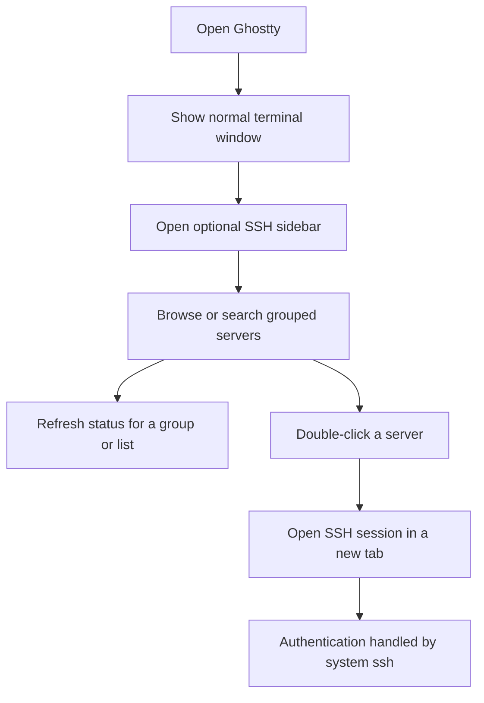

# macOS SSH Connection Sidebar

## Problem Frame

Users who regularly connect to multiple SSH servers need a faster, more
organized way to launch remote sessions from Ghostty without turning every
terminal window into a dedicated SSH manager. The first version should add an
optional macOS sidebar for saved server connections while preserving Ghostty's
normal terminal workflow.

## User Flow

## Requirements

**Sidebar and Tree**
- R1. Ghostty for macOS must provide an optional left sidebar for SSH
  connections without making the sidebar mandatory for normal terminal use.
- R2. The sidebar must display saved connections as a single-level tree:
  groups contain servers; nested folders and tag-based grouping are out of
  scope for the first version.
- R3. Users must be able to hide and show the sidebar from the app UI.
- R4. The sidebar must include search filtering across server name, host,
  username, and notes.
- R5. The sidebar must provide clear empty and no-results states, including an
  entry point to add the first connection when no servers exist.

**Connection Library Management**
- R6. Ghostty must maintain its own SSH connection library instead of relying
  on `~/.ssh/config` as the source of truth.
- R7. Users must be able to create, edit, and delete groups and server
  connections from the macOS UI.
- R8. A server connection must support these first-version fields: display
  name, group, host, port, username, private key file path, and notes.
- R9. Ghostty must not store passwords, private key contents, or key
  passphrases. Authentication remains the responsibility of system `ssh`,
  ssh-agent, Keychain, and user-managed key files.
- R10. Connection library details, including server inventory and private key
  file paths, must not be included in routine logs, crash reports, or
  user-facing diagnostic output.

**Launching Connections**
- R11. Activating a server connection must open an SSH session in a new tab in
  the current terminal window by default.
- R12. Launching a connection must preserve the user's existing local terminal
  sessions and must not inject SSH into the currently active shell.
- R13. SSH connection success, authentication prompts, and connection failures
  may be presented inside the terminal session rather than through a separate
  connection-status dialog.

**Status Display**
- R14. The server tree must show connection reachability states with green for
  online and red for offline.
- R15. Status must not rely on color alone; the UI must also expose a label,
  icon, tooltip, or equivalent accessible cue for states such as online,
  offline, checking, and unknown.
- R16. First-version reachability checks must be user-triggered, such as via a
  refresh action or when expanding a group. Ghostty must not perform continuous
  background scanning of all saved servers.
- R17. Servers whose status has not been checked, or whose last check should no
  longer be treated as current, must appear as unknown rather than online or
  offline.

**Platform Scope**
- R18. The first version targets the macOS app only. Cross-platform behavior
  for GTK/Linux is deferred until the macOS experience is validated.

## Success Criteria

- A macOS user can manage a small SSH connection library entirely from the UI.
- A user can find a saved server quickly by group or search and open it in a
  new tab without disrupting their current terminal.
- Saved connection data does not include authentication secrets.
- Status indicators are useful without introducing background network scanning.
- Users who do not use SSH can keep using Ghostty as a normal terminal.

## Scope Boundaries

- Do not implement a custom SSH protocol client in Ghostty.
- Do not store passwords, private key contents, or key passphrases.
- Do not import or sync `~/.ssh/config` in the first version.
- Do not support nested folders, tags, jump hosts, port forwarding, environment
  variables, startup commands, or per-connection terminal profiles in the first
  version.
- Do not make the SSH sidebar part of the GTK/Linux app in the first version.
- Do not perform background polling of every saved server.

## Key Decisions

- Build a sidebar, not a full app mode: This keeps Ghostty's terminal-first
  workflow intact while adding a faster SSH launch surface.
- Use a Ghostty-owned connection library: The user wants full UI management
  rather than depending on external SSH config files.
- Keep authentication outside Ghostty: This sharply limits security risk and
  keeps the first version focused on connection organization and launching.
- Open connections in new tabs by default: This matches terminal workflows and
  avoids overwriting the active shell context.
- Start with macOS only: The Swift UI surface is the right place to validate the
  product behavior before broadening platform scope.
- Use user-triggered status checks: This gives the requested online/offline
  feedback while avoiding noisy background scanning.

## Dependencies / Assumptions

- Ghostty already has terminal surface configuration capable of launching an
  explicit command, and the existing `ghostty +ssh` wrapper can inform planning
  for how SSH sessions should be launched.
- The macOS app already owns the window/tab UI where a sidebar and new-tab
  launch behavior can be integrated.

## Outstanding Questions

### Resolve Before Planning

- None.

### Deferred to Planning

- [Affects R6-R10][Technical] Decide the durable storage location and file format
  for Ghostty's SSH connection library.
- [Affects R11-R13][Technical] Decide whether launch commands should invoke
  system `ssh` directly or route through Ghostty's existing `+ssh` wrapper.
- [Affects R14-R17][Technical] Define the reachability check behavior, timeout,
  concurrency limit, and failure states.
- [Affects R1-R7][Technical] Decide the macOS UI integration point for the
  sidebar, group editor, and server editor.

## Next Steps

-> /prompts:ce-plan for structured implementation planning
