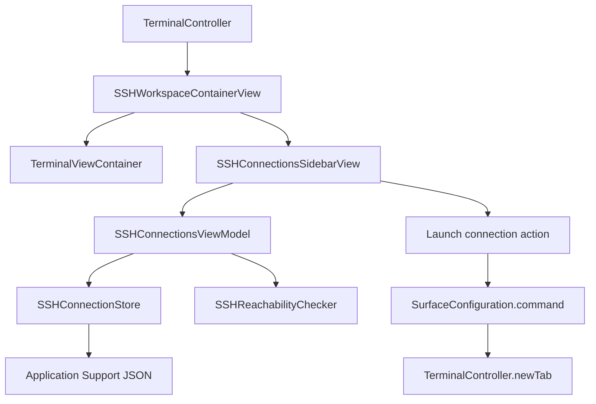
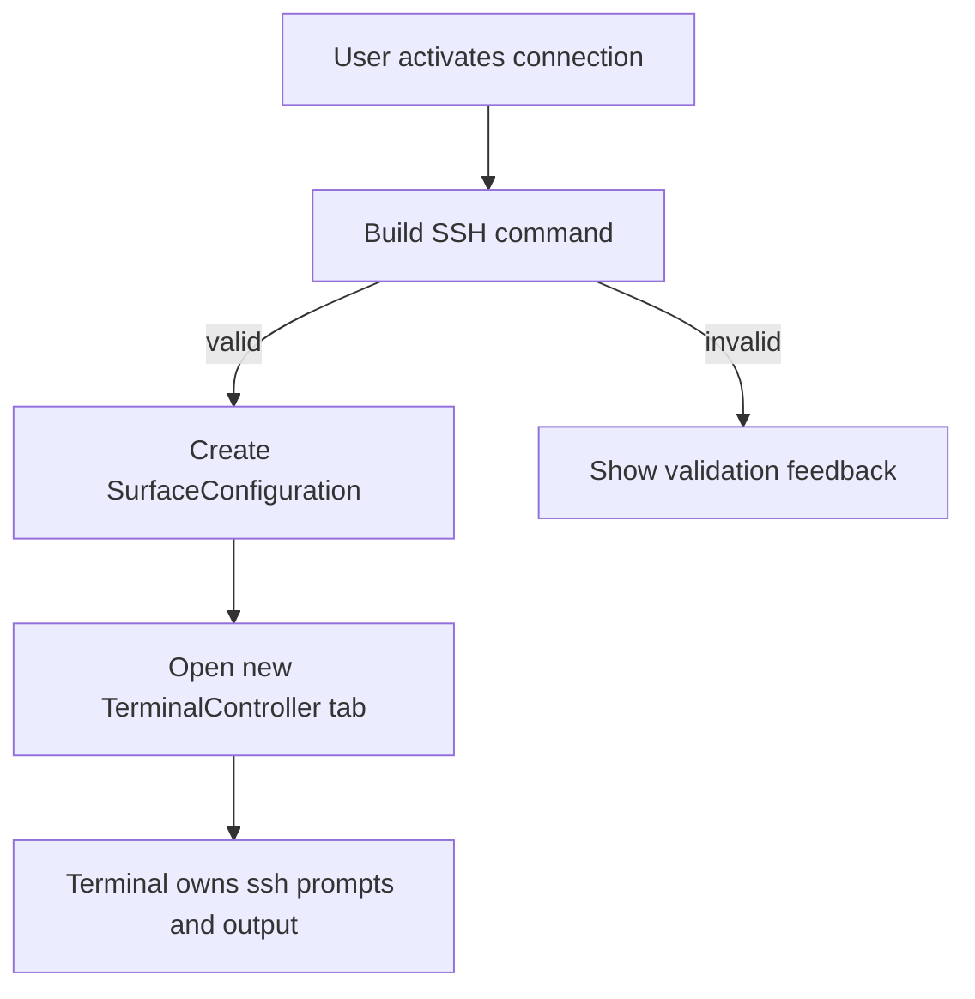

# feat: Add macOS SSH Connection Sidebar

## Overview

Add an optional macOS-only SSH connection sidebar to Ghostty. The sidebar will
let users manage a Ghostty-owned connection library, search grouped servers,
manually refresh reachability status, and open an SSH session in a new tab
without changing the normal terminal-first workflow.

## Problem Frame

The origin requirements define a lightweight SSH launch surface for users who
connect to many servers, while explicitly avoiding a full SSH protocol client or
credential manager. This plan keeps Ghostty's existing terminal, tab, split, and
surface architecture intact, and adds the SSH experience around the terminal
content rather than inside terminal rendering code.

## Requirements Trace

- R1-R5. Optional left sidebar, single-level groups, hide/show, search, and
  empty/no-results states.
- R6-R10. Ghostty-owned connection library with UI CRUD, basic fields, no
  stored secrets, and no routine logging of server inventory or private key
  paths.
- R11-R13. Open activated connections in a new tab without injecting SSH into
  the active shell; terminal session owns prompts and connection failures.
- R14-R17. Show online/offline/checking/unknown status with accessible cues and
  user-triggered refresh only.
- R18. Limit first delivery to the macOS app.

## Scope Boundaries

- macOS only; no GTK/Linux UI changes in this plan.
- No custom SSH protocol implementation.
- No password, private key content, or passphrase storage.
- No `~/.ssh/config` import, sync, or parsing.
- No nested folders, tags, jump hosts, port forwarding, startup commands,
  environment variables, or per-connection terminal profiles.
- No background polling of every saved server.

## Context & Research

### Relevant Code and Patterns

- `macos/Sources/Features/Terminal/TerminalController.swift` creates terminal
  windows and tabs. `TerminalController.newTab(_:from:withBaseConfig:)` already
  accepts `Ghostty.SurfaceConfiguration`, which is the right launch path for
  SSH tabs.
- `TerminalController.windowDidLoad()` currently sets `window.contentView` to a
  `TerminalViewContainer` hosting `TerminalView(ghostty:viewModel:delegate:)`.
  The sidebar should wrap this root content rather than modifying
  `TerminalView` or `TerminalSplitTreeView`.
- `macos/Sources/Ghostty/Surface View/SurfaceView.swift` defines
  `Ghostty.SurfaceConfiguration` with `command`, `workingDirectory`,
  `environmentVariables`, `initialInput`, and `waitAfterCommand`.
- `macos/Sources/Features/App Intents/NewTerminalIntent.swift` shows existing
  new terminal creation through `SurfaceConfiguration`, including tab/window
  selection and parent surface lookup.
- `macos/Sources/Ghostty/Ghostty.Shell.swift` and
  `macos/Tests/Ghostty/ShellTests.swift` provide quoting helpers and tests for
  shell command construction.
- `macos/Sources/Features/Splits/TerminalSplitTreeView.swift` and
  `macos/Sources/Features/Splits/SplitView.swift` show the local SwiftUI style
  for dense tool surfaces and custom split layouts.
- `macos/Sources/Features/Settings/ConfigurationErrorsController.swift` shows a
  simple SwiftUI view hosted inside an AppKit controller.
- `macos/Ghostty.xcodeproj/project.pbxproj` uses
  `PBXFileSystemSynchronizedRootGroup` for `Sources`, `Tests`, and
  `GhosttyUITests`, so new Swift files under those directories should not need
  manual PBX source-file entries.
- `src/cli/ssh.zig` implements `ghostty +ssh`, but it currently logs full SSH
  argv in debug output. That makes it a poor first-version launch path for UI
  saved connections unless redaction is added first.

### Institutional Learnings

- No `docs/solutions/` entries are present in this checkout, so there are no
  local solution learnings to carry forward.

### External References

- No external research was used. The implementation can rely on stable macOS
  AppKit/SwiftUI/Foundation/Network APIs and repo-local patterns.

## Key Technical Decisions

- Add a macOS feature module under `macos/Sources/Features/SSH Connections/`:
  This keeps the new code out of terminal rendering internals and mirrors the
  existing feature-oriented macOS tree.
- Store the connection library as a JSON file under
  `Application Support/<bundle-identifier>/ssh-connections.json`: This is the
  standard macOS location for app-owned user data, keeps it separate from
  Ghostty's terminal config, follows release/debug bundle identity, and avoids
  inventing a new dependency.
- Use a shared main-actor store for the connection library: Multiple terminal
  windows can show the sidebar, so a single observable store avoids diverging
  in-memory copies.
- Launch first-version SSH sessions with system `ssh` rather than
  `ghostty +ssh`: Direct `ssh` avoids depending on the helper CLI path from the
  GUI app and avoids the current `+ssh` debug logging of full connection argv.
  A future pass can route through `+ssh` after its logging behavior is made safe
  for saved connection metadata.
- Open sessions by creating a new tab with `Ghostty.SurfaceConfiguration.command`:
  This follows existing terminal creation APIs and avoids typing into the
  currently focused shell.
- Probe reachability with a user-triggered TCP check using Network.framework:
  This checks host/port reachability without authenticating, avoids spawning
  `ssh` for status refresh, and keeps the feature from scanning servers in the
  background.
- Keep sidebar visibility per window and default hidden: The origin requires an
  optional sidebar. Default-hidden preserves existing Ghostty behavior for users
  who do not use SSH.

## Open Questions

### Resolved During Planning

- Storage location and format: Use a Codable JSON document at
  `Application Support/<bundle-identifier>/ssh-connections.json` with
  best-effort owner-only permissions and atomic writes.
- Launch path: Use system `ssh` directly in the first version, not `ghostty
  +ssh`, due to helper resolution and logging privacy risk.
- Reachability behavior: Use user-triggered TCP reachability checks with an
  unknown default state, checking in-progress state, bounded timeout, and
  bounded concurrency.
- UI integration point: Replace the window content root with a macOS-only
  workspace container from `TerminalController.windowDidLoad()`. The container
  should hold the existing `TerminalViewContainer` as the terminal pane and a
  separate SwiftUI-hosted sidebar pane.

### Deferred to Implementation

- Exact sidebar width and control placement: Tune in SwiftUI while preserving
  the required interactions and non-overlap constraints.
- Final status timeout and concurrency values: Pick conservative defaults during
  implementation and cover them with tests through injectable clocks/probers.

## High-Level Technical Design

> *This illustrates the intended approach and is directional guidance for review, not implementation specification. The implementing agent should treat it as context, not code to reproduce.*

## Implementation Units

- [x] **Unit 1: Connection Library Model and Store**

**Goal:** Add the persistent data layer for groups and server connections.

**Requirements:** R6-R10

**Dependencies:** None

**Files:**
- Create: `macos/Sources/Features/SSH Connections/SSHConnection.swift`
- Create: `macos/Sources/Features/SSH Connections/SSHConnectionGroup.swift`
- Create: `macos/Sources/Features/SSH Connections/SSHConnectionLibrary.swift`
- Create: `macos/Sources/Features/SSH Connections/SSHConnectionStore.swift`
- Test: `macos/Tests/SSH Connections/SSHConnectionStoreTests.swift`

**Approach:**
- Define stable Codable value types for the library, groups, and connections.
  Use stable IDs so UI state and future migrations are not tied to display
  names.
- Represent first-version fields only: display name, group, host, port,
  username, private key file path, and notes.
- Keep credentials out of the model by construction. There should be no fields
  for passwords, private key content, or passphrases.
- Persist the library as JSON at
  `Application Support/<bundle-identifier>/ssh-connections.json`. Use atomic
  writes and best-effort owner-only file permissions for new files.
- Treat a missing file as an empty library, and malformed JSON as a recoverable
  load error that leaves the UI usable with an empty in-memory library.
- Do not log server names, hostnames, usernames, notes, or private key paths in
  load/save errors.

**Execution note:** Implement model and store behavior test-first because this
unit defines persistent user data semantics.

**Patterns to follow:**
- `macos/Sources/Features/Custom App Icon/Extensions/UserDefaults+AppIcon.swift`
  for small Codable persistence style, while using a file instead of
  UserDefaults for the larger connection library.
- `macos/Tests/ColorizedGhosttyIconTests.swift` for encode/decode test shape.

**Test scenarios:**
- Happy path: loading when no library file exists -> returns an empty library
  with no thrown error.
- Happy path: saving a library with two groups and multiple connections, then
  reloading -> preserves IDs, fields, and ordering.
- Edge case: a connection with no private key path -> encodes and reloads with
  no synthesized secret field.
- Error path: malformed JSON on disk -> store reports a load error state but
  does not expose file contents or connection details in the error message.
- Error path: save failure from an unwritable injected directory -> surfaces a
  generic save error and keeps the in-memory library unchanged.
- Integration: default storage path uses the current bundle identifier so debug
  and release builds do not collide unexpectedly.

**Verification:**
- Store tests prove data round-trips, missing and malformed files are handled,
  and error text does not include saved connection metadata.

- [x] **Unit 2: SSH Command Builder**

**Goal:** Convert a saved connection into a safe `SurfaceConfiguration.command`
for a new terminal tab.

**Requirements:** R8-R13

**Dependencies:** Unit 1

**Files:**
- Create: `macos/Sources/Features/SSH Connections/SSHConnectionCommandBuilder.swift`
- Modify: `macos/Sources/Ghostty/Ghostty.Shell.swift` if additional quoting
  helpers are needed.
- Test: `macos/Tests/SSH Connections/SSHConnectionCommandBuilderTests.swift`
- Test: `macos/Tests/Ghostty/ShellTests.swift` if quoting coverage expands.

**Approach:**
- Build a command that invokes system `ssh` with only the first-version fields:
  host, optional port, optional username, and optional private key file path.
- Validate required fields before launch. Empty host or invalid port should
  produce a UI-presentable validation error rather than a shell command.
- Quote every user-controlled command segment with `Ghostty.Shell.quote`.
- Keep private key path as a file path argument only; never read the key file.
- Do not include command strings in logs or routine diagnostics.
- Return enough structured result information for the UI to either launch the
  tab or show validation feedback.

**Execution note:** Implement command-building tests before wiring the builder
into UI actions.

**Patterns to follow:**
- `macos/Sources/Ghostty/Ghostty.Shell.swift`
- `macos/Tests/Ghostty/ShellTests.swift`
- `macos/Sources/Features/App Intents/NewTerminalIntent.swift` for creating a
  `SurfaceConfiguration` from user-provided inputs.

**Test scenarios:**
- Happy path: host `example.com`, port `22`, username `deploy`, no key path ->
  command targets `deploy@example.com` and includes no `-i`.
- Happy path: non-default port and private key path with spaces -> command
  includes quoted `-p` and `-i` values and preserves the destination.
- Edge case: empty username -> command targets the host without a leading `@`.
- Error path: port `0`, port above `65535`, and empty host -> builder returns
  validation errors and no command.
- Error path: host or path containing shell metacharacters -> output is quoted
  and does not create additional shell tokens.

**Verification:**
- Command builder tests demonstrate safe command construction and validation for
  all first-version fields.

- [x] **Unit 3: User-Triggered Reachability Checks**

**Goal:** Add online/offline/checking/unknown status behavior for saved
connections without background scanning.

**Requirements:** R14-R17

**Dependencies:** Unit 1

**Files:**
- Create: `macos/Sources/Features/SSH Connections/SSHConnectionStatus.swift`
- Create: `macos/Sources/Features/SSH Connections/SSHReachabilityChecker.swift`
- Test: `macos/Tests/SSH Connections/SSHReachabilityCheckerTests.swift`

**Approach:**
- Model status as `unknown`, `checking`, `online`, and `offline`.
- Default every saved connection to `unknown` until a user-triggered refresh
  runs.
- Use Network.framework TCP connection checks against the saved host and port.
  Do not run `ssh`, do not authenticate, and do not read key files.
- Support refresh for one connection, a group, or the currently filtered visible
  list.
- Bound concurrent checks so a large library cannot create a burst of network
  activity.
- Apply a timeout and convert DNS failure, timeout, cancellation, and connection
  failure to `offline` unless the refresh is canceled, in which case stale
  statuses should not be overwritten as successful.

**Execution note:** Use injectable probe behavior in tests so unit tests do not
make real network connections.

**Patterns to follow:**
- `macos/Sources/Features/Update/UpdateState.swift` and update tests for small
  state enums and deterministic state assertions.

**Test scenarios:**
- Happy path: fake prober succeeds for one connection -> status transitions
  `unknown` to `checking` to `online`.
- Happy path: refreshing a group only checks connections in that group.
- Error path: fake timeout or connection failure -> status becomes `offline`.
- Edge case: hidden or filtered-out connections are not checked when refreshing
  the visible list.
- Edge case: starting a second refresh while one is running does not create
  duplicate checks for the same connection.

**Verification:**
- Tests prove state transitions, scoping, cancellation/duplicate behavior, and
  no real network dependency in unit tests.

- [x] **Unit 4: Sidebar View Model and SwiftUI UI**

**Goal:** Add the user-facing SSH sidebar, search, empty states, CRUD forms, and
accessible status cues.

**Requirements:** R1-R8, R14-R17

**Dependencies:** Units 1 and 3

**Files:**
- Create: `macos/Sources/Features/SSH Connections/SSHConnectionsViewModel.swift`
- Create: `macos/Sources/Features/SSH Connections/SSHConnectionsSidebarView.swift`
- Create: `macos/Sources/Features/SSH Connections/SSHConnectionEditorView.swift`
- Create: `macos/Sources/Features/SSH Connections/SSHGroupEditorView.swift`
- Test: `macos/Tests/SSH Connections/SSHConnectionsViewModelTests.swift`

**Approach:**
- Keep view model logic independent from the terminal controller so search,
  grouping, validation, and status state can be unit tested.
- Render a single-level tree with groups and servers. Avoid nested group data
  structures.
- Provide toolbar or inline controls for adding groups, adding servers, editing,
  deleting, and refreshing status.
- Provide a search field that filters by display name, host, username, and
  notes.
- Provide empty-library and no-results states with an obvious add-connection
  entry point.
- Show status with color plus non-color cue: icon, text, tooltip, or
  accessibility label for online/offline/checking/unknown.
- Keep destructive delete actions confirmable enough that accidental deletion is
  not silent. In the first version, deleting a non-empty group should be blocked
  until the user moves or deletes its connections explicitly.

**Patterns to follow:**
- `macos/Sources/Features/Command Palette/CommandPalette.swift` and
  `TerminalCommandPalette.swift` for dense SwiftUI controls hosted in the
  terminal window.
- `macos/Sources/Features/Settings/ConfigurationErrorsView.swift` for simple
  SwiftUI state-driven UI.

**Test scenarios:**
- Happy path: library with two groups renders view-model sections in saved
  order with the right connections under each group.
- Happy path: search for display name, host, username, and notes returns the
  expected filtered connections.
- Edge case: empty library exposes an empty state and add-connection affordance.
- Edge case: search with no matches exposes a no-results state and does not
  delete or mutate the underlying library.
- Error path: invalid editor input prevents save and returns field-specific
  validation feedback.
- Error path: deleting a non-empty group is blocked with a clear explanation.
- Integration: status updates from the checker are reflected in the view model
  without changing stored connection data.

**Verification:**
- View model tests cover filtering, grouping, validation, empty/no-results
  states, and status propagation. UI review confirms text does not overlap at
  typical compact and wide terminal sizes.

- [x] **Unit 5: Terminal Window Integration and New-Tab Launch**

**Goal:** Integrate the sidebar into normal macOS terminal windows and launch
connections into new tabs.

**Requirements:** R1-R3, R11-R13, R18

**Dependencies:** Units 2 and 4

**Files:**
- Create: `macos/Sources/Features/SSH Connections/SSHWorkspaceContainerView.swift`
- Modify: `macos/Sources/Features/Terminal/TerminalController.swift`
- Modify: `macos/Sources/Features/Terminal/TerminalViewContainer.swift` only if
  the existing container needs a small API to host the workspace cleanly.
- Test: `macos/Tests/SSH Connections/SSHWorkspaceContainerViewTests.swift` if
  workspace state is separated for testing.
- Test: `macos/Tests/Terminal/TerminalViewContainerTests.swift` if the container
  behavior changes.

**Approach:**
- In `TerminalController.windowDidLoad()`, build the existing
  `TerminalViewContainer` as the terminal pane, then place it inside a new
  `SSHWorkspaceContainerView` alongside a SwiftUI-hosted optional sidebar.
- Keep `TerminalViewContainer` responsible for terminal hosting and
  window-level glass/background behavior; the workspace container should arrange
  panes, not replace terminal rendering responsibilities.
- Keep sidebar visibility per terminal window and default hidden.
- Add a controller method that takes a saved connection, asks Unit 2 for a
  launch configuration, and calls
  `TerminalController.newTab(ghostty, from: window, withBaseConfig: config)`.
- Do not use `initialInput` to type `ssh` into the active shell. Use a new
  surface configuration for a new tab.
- Ensure SSH command tabs remain non-restorable under the existing
  `base.command` behavior in `TerminalController`.
- Preserve existing focus behavior by returning focus to the terminal after
  launching or closing sidebar sheets.

**Technical design:** Directional shape for the launch flow:

**Patterns to follow:**
- `TerminalController.newTab(_:from:withBaseConfig:)`
- `NewTerminalIntent.perform()` for parent window and `SurfaceConfiguration`
  use.
- `TerminalViewContainer` for preserving window-level glass/background behavior.

**Test scenarios:**
- Happy path: launching a valid saved connection calls the new-tab path with a
  command-backed `SurfaceConfiguration`.
- Error path: invalid connection data shows validation feedback and does not
  create a tab.
- Edge case: no current parent window -> launch falls back to the existing
  `newTab` behavior that creates a new window when needed.
- Integration: sidebar show/hide does not mutate the split tree or focused
  surface.

**Verification:**
- Unit-level launch tests or controller seams prove valid and invalid launch
  behavior. Manual app verification confirms existing local terminals remain
  untouched when launching SSH.

- [x] **Unit 6: Menu, Command Entry Points, and Privacy Review**

**Goal:** Expose the sidebar from the macOS app UI and complete safety checks
around diagnostics and build integration.

**Requirements:** R1, R3, R10, R18

**Dependencies:** Units 1-5

**Files:**
- Modify: `macos/Sources/App/macOS/MainMenu.xib`
- Modify: `macos/Sources/App/macOS/AppDelegate.swift`
- Modify: `macos/Sources/Features/Terminal/BaseTerminalController.swift` or
  `macos/Sources/Features/Terminal/TerminalController.swift`, depending on the
  narrowest action ownership.
- Test: `macos/Tests/Ghostty/MenuShortcutManagerTests.swift` if the menu entry
  participates in configurable shortcuts.
- Test: `macos/Tests/SSH Connections/SSHConnectionPrivacyTests.swift`

**Approach:**
- Add a menu item to show/hide SSH connections for the active terminal window.
  Keep it disabled or hidden when no normal terminal window can receive it.
- Do not add a command-palette entry in the first version. Keep entry points to
  the menu and visible sidebar controls to avoid widening the action surface.
- Review logging touched by the implementation. Any errors from store, command
  building, probing, or launch should avoid hostnames, usernames, notes, and
  private key paths.
- Avoid touching `macos/Ghostty.xcodeproj/project.pbxproj` unless Xcode does not
  pick up the synchronized source/test directories as expected.

**Patterns to follow:**
- `AppDelegate.setupMenuImages()` for assigning SF Symbols to menu items.
- Existing menu actions in `AppDelegate` and `BaseTerminalController`.
- Existing logger usage with explicit privacy annotations.

**Test scenarios:**
- Happy path: active terminal window receives the toggle action and flips
  sidebar visibility.
- Edge case: no terminal window is active -> menu validation prevents a
  meaningless toggle.
- Error path: store/probe/launch errors render generic diagnostics that do not
  include hostnames, usernames, notes, or private key paths.
- Integration: new Swift files under `Sources` and `Tests` build through the
  filesystem-synchronized Xcode groups without manual project-file churn.

**Verification:**
- Tests cover privacy-safe error text and toggle routing. Build verification
  confirms source and test files are included by the Xcode synchronized groups.

## System-Wide Impact

- **Interaction graph:** The new feature touches `TerminalController` window
  setup, AppDelegate menu routing, SwiftUI sidebar state, persistent JSON
  storage, Network.framework reachability checks, and
  `SurfaceConfiguration.command` tab creation.
- **Error propagation:** Store, validation, command-building, and reachability
  errors should become generic UI messages. Sensitive connection metadata must
  not be interpolated into logs or diagnostics.
- **State lifecycle risks:** Multiple windows may show the same library.
  Mutations should flow through one shared main-actor store so windows do not
  overwrite each other's changes with stale copies.
- **API surface parity:** AppleScript and App Intents already support
  command-backed terminal creation. This plan does not add SSH sidebar controls
  to those automation surfaces in the first version.
- **Integration coverage:** Unit tests should cover model/store/command/status
  behavior. Manual app verification is still needed for window layout, focus,
  menu routing, and tab creation.
- **Unchanged invariants:** Existing terminal startup, splits, native tabs,
  quick terminal, AppleScript, App Intents, and shell integration behavior must
  continue to work without using the SSH sidebar.

## Risks & Dependencies

| Risk | Mitigation |
|------|------------|
| Connection metadata leaks through logs or crash diagnostics | Keep errors generic, avoid logging command strings, and add privacy-focused tests. |
| `ghostty +ssh` would provide better Ghostty remote integration but currently logs argv | Use direct system `ssh` for the first version; revisit `+ssh` only after redaction. |
| Multiple windows race while editing the shared library | Use one shared main-actor store with serialized save operations. |
| Reachability checks create network noise | Run only on explicit user refresh or group expansion, cap concurrency, and use short timeouts. |
| Sidebar layout disrupts terminal sizing or focus | Wrap the terminal outside `TerminalView` and test show/hide behavior without touching split-tree state. |
| Xcode synchronized groups behave differently on older tooling | Verify the macOS build; only edit the project file if the new files are not included. |

## Documentation / Operational Notes

- Add a short user-facing documentation note after implementation describing
  where the connection library lives, what fields are stored, and what is not
  stored.
- Mention that reachability is a manual TCP check, not an authenticated SSH
  login test.
- Note that `~/.ssh/config` import and `ghostty +ssh` routing are not part of
  the first version.

## Sources & References

- **Origin document:** [docs/brainstorms/2026-06-15-macos-ssh-connection-sidebar-requirements.md](../brainstorms/2026-06-15-macos-ssh-connection-sidebar-requirements.md)
- Related code: `macos/Sources/Features/Terminal/TerminalController.swift`
- Related code: `macos/Sources/Features/Terminal/TerminalViewContainer.swift`
- Related code: `macos/Sources/Features/Terminal/TerminalView.swift`
- Related code: `macos/Sources/Ghostty/Surface View/SurfaceView.swift`
- Related code: `macos/Sources/Ghostty/Ghostty.Shell.swift`
- Related code: `macos/Sources/Features/App Intents/NewTerminalIntent.swift`
- Related code: `src/cli/ssh.zig`
